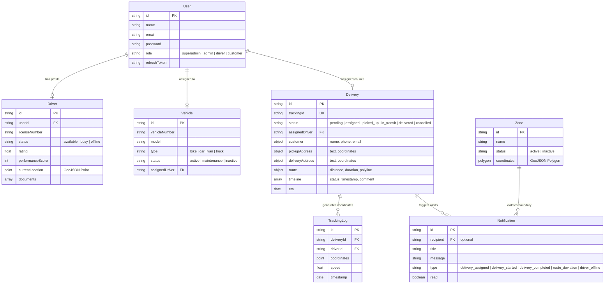

# TrackNow | Real-Time Logistics & Delivery Tracking System

TrackNow is a complete, production-ready Real-Time Logistics and Fleet Delivery Management system built on the MERN stack. It leverages WebSockets (Socket.io) for low-latency live coordinate updates, Redis for geolocation caching/queues/session cache, and Google Maps API for vehicle plotting, routing polylines, and geofenced zones.

---

## 🏗️ System Architecture & ER Diagram



---

## 📂 Project Structure

```
TrackNow/
├── docker-compose.yml
├── nginx.conf
├── README.md
├── backend/
│   ├── src/
│   │   ├── config/
│   │   │   ├── db.js            # MongoDB Mongoose Connection
│   │   │   ├── redis.js         # Redis client configuration
│   │   │   └── socket.js        # Socket.io authentication & event routing
│   │   ├── models/              # Mongoose DB Schemas
│   │   │   ├── User.js
│   │   │   ├── Driver.js
│   │   │   ├── Vehicle.js
│   │   │   ├── Delivery.js
│   │   │   ├── TrackingLog.js
│   │   │   ├── Zone.js
│   │   │   └── Notification.js
│   │   ├── middleware/          # JWT, Role authorization, and rate limiting
│   │   │   ├── auth.js
│   │   │   ├── rateLimiter.js
│   │   │   └── errorHandler.js
│   │   ├── controllers/         # Business logic handlers
│   │   │   ├── authController.js
│   │   │   ├── deliveryController.js
│   │   │   ├── driverController.js
│   │   │   ├── trackingController.js
│   │   │   ├── zoneController.js
│   │   │   └── analyticsController.js
│   │   ├── routes/              # Express endpoint bindings
│   │   │   ├── authRoutes.js
│   │   │   ├── deliveryRoutes.js
│   │   │   ├── driverRoutes.js
│   │   │   ├── trackingRoutes.js
│   │   │   ├── zoneRoutes.js
│   │   │   └── analyticsRoutes.js
│   │   ├── services/            # Sub-system integrations
│   │   │   ├── googleMapsService.js
│   │   │   ├── geofenceService.js
│   │   │   └── redisService.js
│   │   └── server.js            # Node startup entrypoint
│   ├── package.json
│   ├── Dockerfile
│   └── ecosystem.config.js      # PM2 Clustering
└── frontend/
    ├── src/
    │   ├── components/
    │   │   ├── Common/          # Navbar, Sidebar, PageHeader
    │   │   │   ├── Sidebar.jsx
    │   │   │   ├── Navbar.jsx
    │   │   │   └── PageHeader.jsx
    │   │   ├── Map/             # Live tracking maps & Geofence polygons
    │   │   │   ├── LiveMap.jsx
    │   │   │   └── GeofenceEditor.jsx
    │   │   └── ProtectedRoute.jsx
    │   ├── context/
    │   │   └── SocketContext.jsx # WebSocket Connection context
    │   ├── store/               # Redux state configuration
    │   │   ├── slices/
    │   │   │   ├── authSlice.js
    │   │   │   ├── deliverySlice.js
    │   │   │   ├── driverSlice.js
    │   │   │   └── notificationSlice.js
    │   │   └── store.js
    │   ├── pages/               # Client views
    │   │   ├── Login.jsx
    │   │   ├── Register.jsx
    │   │   ├── Dashboard.jsx
    │   │   ├── Deliveries.jsx
    │   │   ├── Drivers.jsx
    │   │   ├── Zones.jsx
    │   │   ├── Analytics.jsx
    │   │   ├── Settings.jsx
    │   │   └── TrackingPortal.jsx
    │   ├── theme.js             # Glassmorphic UI theme
    │   ├── App.jsx
    │   ├── main.jsx
    │   └── index.css
    ├── package.json
    ├── vite.config.js
    └── Dockerfile
```

---

## 🔌 API Documentation

All API endpoints are prefixed with `/api`. Authenticated endpoints require a `Bearer <JWT_ACCESS_TOKEN>` header.

### 🔑 Authentication Module
- `POST /auth/register`: Create customer account.
- `POST /auth/login`: Authenticate credentials. Returns access/refresh tokens.
- `POST /auth/refresh`: Rotate expired access token using refresh token.
- `POST /auth/logout`: Invalidate session refresh token.
- `POST /auth/forgot-password`: Generates reset token.
- `POST /auth/reset-password/:token`: Commits new password.

### 📦 Delivery Module
- `GET /deliveries`: Get list of deliveries. (Drivers get assigned list; Admins get full listing).
- `POST /deliveries`: Register shipment order. *(Admin/Superadmin only)*
- `GET /deliveries/:id`: Fetch specific delivery.
- `PUT /deliveries/:id`: Update shipment info. *(Admin/Superadmin only)*
- `DELETE /deliveries/:id`: Cancel/Delete shipment order. *(Admin/Superadmin only)*
- `POST /deliveries/:id/assign`: Assign delivery agent to shipment. *(Admin/Superadmin only)*
- `PUT /deliveries/:id/status`: Update order state (pending, assigned, picked_up, in_transit, delivered, cancelled).

### 🚚 Driver Module
- `GET /drivers`: List all drivers. *(Admin/Superadmin only)*
- `POST /drivers`: Register new driver profile. *(Admin/Superadmin only)*
- `PUT /drivers/:id`: Update scorecard/ratings/license parameters. *(Admin/Superadmin only)*
- `DELETE /drivers/:id`: Delete driver user & record. *(Admin/Superadmin only)*
- `GET /drivers/profile`: Retrieve profile info. *(Driver only)*
- `POST /drivers/:id/documents`: Upload commercial licenses.

### 🧭 Telemetry Tracking Module
- `POST /tracking/update`: Push GPS position update. *(Driver only)*
- `GET /tracking/history/:deliveryId`: Fetch historical route logs.
- `GET /tracking/fleet`: View active vehicle positions. *(Admin/Superadmin only)*

### 🗺️ Geofencing Zone Module
- `GET /zones`: Fetch list of geofencing boundaries.
- `POST /zones`: Create polygon zone. *(Admin/Superadmin only)*
- `DELETE /zones/:id`: Delete geofence zone. *(Admin/Superadmin only)*

### 📊 Analytics Module
- `GET /analytics/dashboard`: Fetch KPIs, success rates, revenues, fuel estimates, and charts. *(Admin/Superadmin only, cached in Redis)*

### 🔍 Guest Shipment Tracking Portal
- `GET /customer/track/:trackingId`: Public tracking details (returns route, status timeline, ETA, and live location coordinate).

---

## 🛠️ Local Setup Guide

### Option A: Running with Docker Compose (Recommended)

Make sure you have [Docker](https://www.docker.com/) installed on your machine.

1. Configure environment variables in `docker-compose.yml` if necessary (e.g. your Google Maps API key).
2. Spin up the containers from the project root:
   ```bash
   docker-compose up --build
   ```
3. The platform will boot up at:
   - Frontend client: `http://localhost:3000`
   - Express server API: `http://localhost:5000`

### Option B: Raw Local Development Execution

#### 1. Setup Backend
```bash
cd backend
npm install
# Create a .env file and set MONGO_URI, REDIS_URL, JWT_ACCESS_SECRET, JWT_REFRESH_SECRET, GOOGLE_MAPS_API_KEY
npm run dev
```

#### 2. Setup Frontend
```bash
cd ../frontend
npm install
# Start local development server
npm run dev
```
Open `http://localhost:3000` in your browser.

---

## 🚀 AWS EC2 Production Deployment Guide

Follow these steps to deploy TrackNow on an AWS EC2 instance.

### Step 1: Launch EC2 Instance & Open Port Rules
1. Launch an EC2 instance using **Ubuntu Server 22.04 LTS**.
2. Under the **Security Group**, configure inbound port rules:
   - HTTP (Port 80)
   - HTTPS (Port 443)
   - SSH (Port 22)
   - Node Port (Port 5000) - optional/development

### Step 2: Install Node, Redis, MongoDB, Nginx, and PM2
Connect to the server via SSH and execute:
```bash
sudo apt update && sudo apt upgrade -y

# Install Docker & Docker Compose (or install Node/Nginx directly)
sudo apt install docker.io docker-compose -y
sudo systemctl enable docker
sudo systemctl start docker
```

### Step 3: Git Clone and Configure environment variables
Clone the repository, configure the API endpoints:
```bash
git clone <your-repo-url> /var/www/tracknow
cd /var/www/tracknow
```

### Step 4: Run Production Build with Docker Compose
Run the containerized production stack using Docker:
```bash
sudo docker-compose -f docker-compose.yml up -d
```
This boots up Redis, MongoDB, Backend (managed by PM2 inside container), and Frontend Nginx server.

### Step 5: Configure Host Reverse Proxy (Nginx) & SSL
If you want to configure Nginx on the host machine to bind SSL certificates (using Let's Encrypt Let's Encrypt / Certbot):
```bash
sudo apt install nginx certbot python3-certbot-nginx -y
```
Copy the project's `nginx.conf` parameters into `/etc/nginx/sites-available/tracknow` and create a symbolic link to `sites-enabled`.

Then, request SSL certificate:
```bash
sudo certbot --nginx -d yourdomain.com
sudo systemctl restart nginx
```
Your Real-Time Logistics & Delivery Tracking system is now fully live and secured in production!
